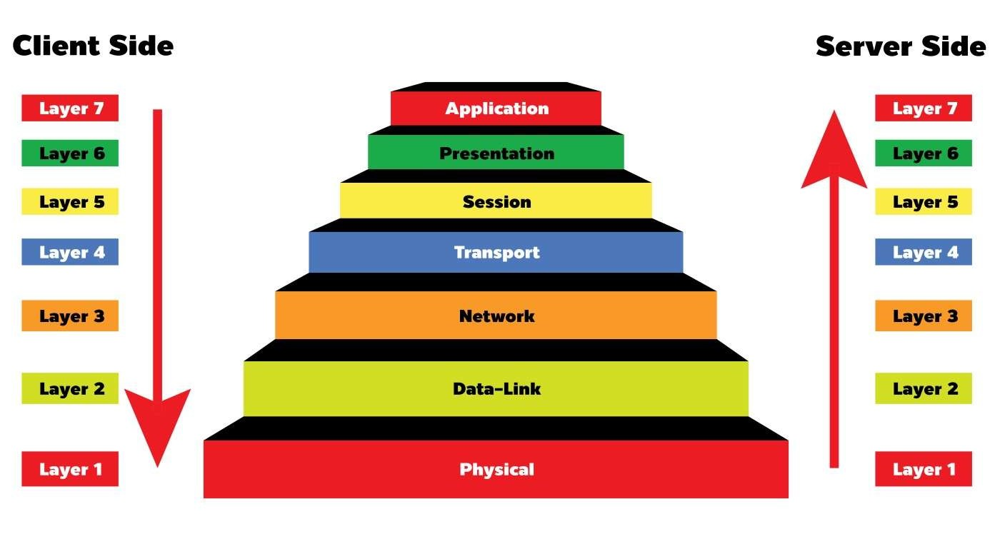
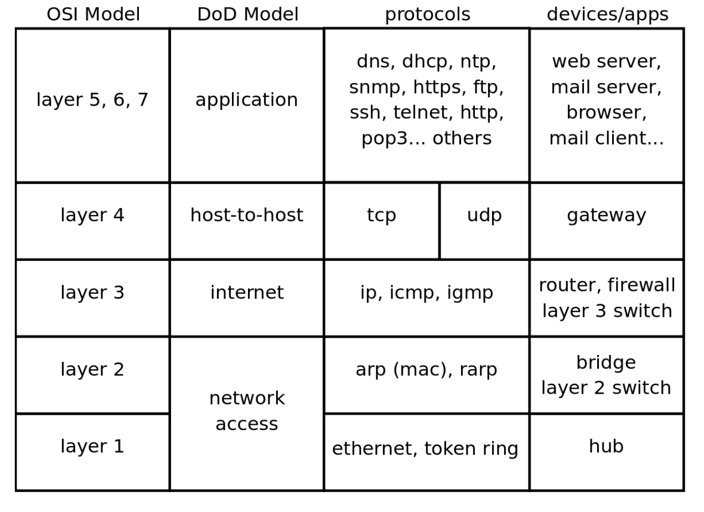
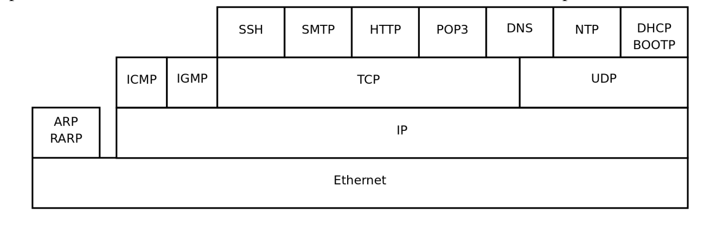
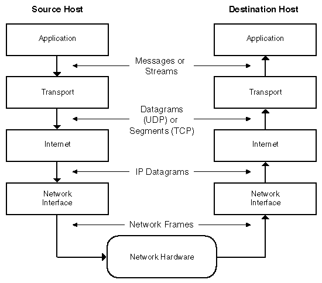

## Networking Notes

- [Networking Notes:](#networking-notes)
- [OSI Model](#osi-model)
- [Four DoD layers](#four-dod-layers)
- [TCP/IP Model](#tcpip-model)
- [IP Addresses:](#ip-addresses)
  - [Concepts:](#concepts)
  - [Resources:](#resources)
- [DNS:](#dns)
  - [Concepts:](#concepts-1)
  - [Resources:](#resources-1)
- [Proxy server](#proxy-server)
- [Routing Bridging and NAT](#routing-bridging-and-nat)
- [Firewalls and Ports](#firewalls-and-ports)
- [References:](#references)

---

## 1. OSI Model



1, Tầng Vật lý (Physical Layer): Tầng vật lý đảm nhiệm việc truyền dữ liệu qua các phương tiện truyền thông vật lý như cáp, sóng radio, hoặc quang học. Nó xác định các đặc điểm về điện, cơ và chức năng của các giao diện vật lý và các thông số kỹ thuật của các thiết bị mạng.

2, Tầng Liên kết dữ liệu (Data Link Layer): Tầng liên kết dữ liệu kiểm soát việc truyền dữ liệu giữa các thiết bị trên cùng một đường truyền vật lý. Nó chia dữ liệu thành các khung (frames) và xác định địa chỉ vật lý (MAC address) để định danh các thiết bị trong mạng.

3, Tầng Mạng (Network Layer): Tầng mạng quản lý việc định tuyến (routing) và chuyển tiếp (forwarding) dữ liệu qua các mạng khác nhau. Nó sử dụng địa chỉ logic (địa chỉ IP) để xác định đích của các gói tin và điều khiển việc truyền dữ liệu giữa các mạng con.

4, Tầng Giao vận (Transport Layer): Tầng giao vận cung cấp các dịch vụ truyền tải dữ liệu tin cậy và kiểm soát luồng dữ liệu. Nó chia dữ liệu thành các đoạn (segments) và đảm bảo rằng các đoạn này được chuyển đến đúng đích và theo đúng thứ tự.

5, Tầng Phiên (Session Layer): Tầng phiên thiết lập, duy trì và đóng các phiên giao tiếp (sessions) giữa các ứng dụng trên các thiết bị khác nhau. Nó quản lý việc bắt đầu, kết thúc và đồng bộ hóa các phiên giao tiếp.

6, Tầng Trình diễn (Presentation Layer): Tầng trình diễn chịu trách nhiệm cho việc định dạng, mã hóa và nén dữ liệu để đảm bảo tính toàn vẹn và tương thích giữa các hệ thống khác nhau. Nó xử lý các vấn đề như mã hóa, nén, mã hóa và định dạng dữ liệu.

7, Tầng Ứng dụng (Application Layer): Tầng ứng dụng cung cấp các dịch vụ trực tiếp cho người dùng cuối. Nó chứa các giao thức và ứng dụng như HTTP (truyền tải siêu văn bản), SMTP (gửi thư điện tử) và FTP (truyền tải tập tin).

## 2. DoD Four-layers Model

Mô hình DoD (tcp/ip) chỉ có bốn tầng, xấp xỉ ánh xạ tầng truy cập mạng của nó với tầng 1 và 2 của mô hình OSI (Vật lý và Liên kết dữ liệu), tầng internet (IP) của nó với tầng mạng của OSI, tầng máy chủ-đến-máy chủ (tcp, udp) của nó với tầng 4 của OSI (giao vận) và tầng ứng dụng của nó với tầng 5, 6 và 7 của OSI.



1, Network Access Layer: Chịu trách nhiệm vận chuyển dữ liệu qua phương tiện vật lý cụ thể đang sử dụng. Các giao thức khác nhau được chọn từ tầng này, tùy thuộc vào loại mạng vật lý được sử dụng.

2, Internet Layer: Chịu trách nhiệm vận chuyển dữ liệu qua loạt các mạng vật lý khác nhau kết nối giữa máy nguồn và máy đích. Giao thức định tuyến (routing protocols) liên quan chặt chẽ nhất với tầng này, cũng như Giao thức IP (IP Protocol), giao thức cơ bản của Internet.

3, Host-to-Host Layer: Xử lý việc tiếp hẹn kết nối, kiểm soát luồng dữ liệu, truyền lại dữ liệu bị mất và các quản lý dòng dữ liệu tổng quát khác. Hai giao thức TCP và UDP, mỗi giao thức đóng vai trò quan trọng nhất tại tầng này.

4, Process Layer: chứa các giao thức thực hiện các chức năng cấp người dùng, chẳng hạn như gửi thư điện tử, truyền tải tập tin và đăng nhập từ xa.


## 3. TCP/IP Model

Mô hình TCP/IP, tương tự mô hình OSI, có một tập hợp các tầng. Mô hình OSI có bảy tầng và mô hình TCP/IP có bốn tầng.

Mô hình TCP/IP và mô hình OSI được tạo ra độc lập. Mô hình TCP/IP đại diện cho thực tế trong thế giới thực, trong khi mô hình OSI đại diện cho một tưởng tượng lý tưởng.



1, Tầng Ứng dụng (Application Layer):

- Xác định giao thức ứng dụng TCP/IP và cách các chương trình máy chủ tương tác với dịch vụ tầng vận chuyển để sử dụng mạng.
- Các giao thức: HTTP, FTP, SMTP, DNS.


2, Tầng Vận chuyển (Transport Layer):

- Cung cấp quản lý phiên giao tiếp giữa các nút/máy tính. Xác định mức dịch vụ và trạng thái của kết nối được sử dụng khi vận chuyển dữ liệu.
- Các giao thức: TCP, UDP, RTP.

3, Tầng Internet (Internet Layer):

- Đóng gói dữ liệu thành các gói tin IP chứa thông tin địa chỉ nguồn và đích được sử dụng để chuyển tiếp các gói tin giữa máy chủ và mạng. Thực hiện việc định tuyến các gói tin IP.
- Các giao thức: IP, ICMP, ARP, RARP.

4, Tầng Truy cập Mạng (Network Access Layer):

- Chỉ định chi tiết về cách dữ liệu được gửi vật lý qua mạng, bao gồm cách các bit được truyền tín hiệu điện tử bởi các thiết bị phần cứng.
- Các giao thức: Ethernet, Frame Relay, RS-2.

  


## 4. IP Addresses

### 4.1 Khái niệm

Mỗi thiết bị kết nối với internet có một định danh duy nhất. Hầu hết các mạng hiện nay, bao gồm tất cả các máy tính trên internet, sử dụng giao thức TCP/IP như một tiêu chuẩn để giao tiếp trên mạng. Trong giao thức TCP/IP, định danh duy nhất là Địa chỉ IP. Hai loại Địa chỉ IP là IPv4 và IPv6.

Các phần tám bit này được gọi là **octet**. Ví dụ **IP Address** sau đó trở thành **11000000.10101000.01111011.10000100**. Số này chỉ hợp lý hơn một chút, cho nên trong hầu hết các trường hợp, chuyển đổi địa chỉ nhị phân thành định dạng thập phân dotted-decimal (192.168.123.132). Các số thập phân được ngăn cách bởi dấu chấm là các **octet** được chuyển đổi từ hệ số nhị phân sang hệ thập phân.

Đối với mạng TCP/IP (WAN), để hoạt động hiệu quả như một tập hợp các networ, các bộ định tuyến chuyển tiếp gói dữ liệu giữa các network không biết chính xác vị trí của một máy chủ mà thông tin package được gửi đến. Các bộ định tuyến chỉ biết máy chủ thuộc mạng nào và sử dụng thông tin được lưu trữ trong bảng định tuyến của chúng để xác định cách đưa gói tin đến mạng đích của máy chủ đích. Sau khi gói tin được chuyển đến mạng đích, gói tin được chuyển đến máy chủ thích hợp.

### 4.2 IPv4 so với IPv6

- IPv4 sử dụng 32 bit nhị phân để tạo ra một địa chỉ duy nhất trên mạng. Một địa chỉ IPv4 được biểu diễn bằng bốn số được ngăn cách bởi dấu chấm. Mỗi số là biểu diễn thập phân (hệ cơ số 10) cho một số nhị phân (hệ cơ số 2) gồm tám chữ số, còn được gọi là octet.

  

- IPv6 sử dụng 128 bit nhị phân để tạo ra một địa chỉ duy nhất trên mạng. Một địa chỉ IPv6 được biểu diễn bằng tám nhóm số thập lục phân (hệ cơ số 16) được ngăn cách bởi dấu hai chấm. Các nhóm số chứa toàn số không thường được bỏ qua để tiết kiệm không gian, chỉ còn lại dấu hai chấm để đánh dấu khoảng trống.

  


### 4.3 IP Classes

Thông thường, IPv4 cho phép chúng ta có các địa chỉ từ 0.0.0.0 đến 255.255.255.255. Tuy nhiên, một số số trong khoảng đó được dành riêng cho mục đích cụ thể trên các mạng TCP/IP. Những sự dành riêng này được công nhận bởi cơ quan quản lý địa chỉ TCP/IP, Tổ chức Định danh Số Internet (IANA). Bốn sự dành riêng cụ thể bao gồm:

- 0.0.0.0 - Đại diện cho mạng mặc định, là khái niệm trừu tượng về việc chỉ được kết nối với mạng TCP/IP.

- 255.255.255.255 - Địa chỉ network broadcasts, tức là các messages được gửi tới tất cả các máy tính trên network.

- 127.0.0.1 - Đây được gọi là loopback address, có nghĩa là cách máy tính xác định chính nó, dù có được gán địa chỉ IP hay không.

- 169.254.0.1 đến 169.254.255.254 - Đây là phạm vi IP Address Automatic Private (APIPA) được gán tự động khi một máy tính không thành công trong việc nhận địa chỉ từ máy chủ DHCP.

Các địa chỉ IP khác được dành cho các lớp con mạng (subnet class). Một subnet là một mạng con, được kết nối với mạng lớn hơn thông qua một bộ định tuyến. Subnet có thể có hệ thống địa chỉ riêng để các máy tính trên cùng một subnet có thể giao tiếp nhanh chóng mà không cần gửi dữ liệu qua mạng lớn hơn. Một bộ định tuyến trên một mạng TCP/IP, bao gồm Internet, được cấu hình để nhận ra một hoặc nhiều subnet và điều hướng lưu lượng mạng một cách phù hợp. Dưới đây là các địa chỉ IP được dành riêng cho các subnet:

- 10.0.0.0 đến 10.255.255.255 - Nằm trong phạm vi địa chỉ Lớp A từ 1.0.0.0 đến 127.0.0.0, trong đó bit đầu tiên là 0.

- 172.16.0.0 đến 172.31.255.255 - Nằm trong phạm vi địa chỉ Lớp B từ 128.0.0.0 đến 191.255.0.0, trong đó hai bit đầu tiên là 10.

- 192.168.0.0 đến 192.168.255.255 - Nằm trong phạm vi Lớp C từ 192.0.0.0 đến 223.255.255.0, trong đó ba bit đầu tiên là 110.

- Multicast (trước đây được gọi là Lớp D) - Bốn bit đầu tiên trong địa chỉ là 1110, với địa chỉ nằm trong khoảng từ 224.0.0.0 đến 239.255.255.255.

- Dành cho future/experimental việc sử dụng (trước đây được gọi là Lớp E) - địa chỉ từ 240.0.0.0 đến 254.255.255.254.

### 4.4 Subnet mask
  
Subnet mask là yêu cầu để TCP/IP hoạt động, là mặt nạ subnet (subnet mask). Subnet mask được sử dụng bởi giao thức TCP/IP để xác định xem một máy chủ có thuộc subnet cục bộ hay mạng từ xa.

Trong TCP/IP, các phần của địa chỉ IP được sử dụng làm địa chỉ mạng và địa chỉ máy chủ không cố định, vì vậy các địa chỉ mạng và địa chỉ máy chủ ở trên không thể xác định trừ khi có thêm thông tin. Thông tin này được cung cấp trong một số 32 bit khác gọi là subnet mask. Trong ví dụ này, subnet mask là **255.255.255.0**. Không rõ ý nghĩa của số này trừ khi biết rằng 255 trong hệ nhị phân tương đương với 11111111; vì vậy, subnet mask là **11111111.11111111.11111111.0000000**

Sắp xếp IP Address và subnet mask cùng nhau, phần mạng và phần máy chủ của địa chỉ có thể được tách ra:

- 11000000.10101000.01111011.10000100 - Địa chỉ IP (192.168.123.132)

- 11111111.11111111.11111111.00000000 - Mặt nạ subnet (255.255.255.0)

24 bit đầu tiên (số bit 1 trong subnet mask) được xác định là địa chỉ network, với 8 bit cuối cùng (số bit 0 còn lại trong subnet mask) được xác định là địa chỉ máy chủ.

- 11000000.10101000.01111011.00000000 - Địa chỉ mạng (192.168.123.0)

- 00000000.00000000.00000000.10000100 - Địa chỉ máy chủ (000.000.000.132)
 

- 24 bit đầu tiên (số 1 trong subnet mask) được xác định là địa chỉ mạng, 8 bit cuối cùng (số số 0 còn lại trong mặt nạ mạng con) được xác định là địa chỉ máy chủ. Điều này cung cấp những điều sau đây:

- 11000000.10101000.01111011.00000000 -- Địa chỉ mạng (192.168.123.0)

- 00000000.00000000.00000000.10000100 -- Địa chỉ máy chủ (000.000.000.132)
 

Cho ví dụ sử dụng subnet mask 255.255.255.0, ID network là 192.168.123.0 và địa chỉ máy chủ là 0.0.0.132. Khi một gói tin đến trên subnet 192.168.123.0 (từ subnet cục bộ hoặc mạng từ xa) và có địa chỉ đích là 192.168.123.132, máy tính sẽ nhận nó từ mạng và xử lý.

Hầu hết các subnet mask thập phân chuyển đổi thành số nhị phân với tất cả các bit 1 bên trái và tất cả các bit 0 bên phải. Một số subnet mask phổ biến khác là:

| Decimal          |  Binary                           |
|------------------|-----------------------------------|
| 255.255.255.192  | 1111111.11111111.1111111.11000000 |
| 255.255.255.224  | 1111111.11111111.1111111.11100000 |

### 4.5 Subnetting
    
Một mạng TCP/IP class A, B hoặc C có thể được chia nhỏ hơn, hoặc subnetted, bởi một quản trị hệ thống. Điều này trở nên cần thiết khi cân nhắc về sơ đồ địa chỉ logic của Internet (thế giới trừu tượng của địa chỉ IP và các mạng con) với các mạng vật lý được sử dụng trong thực tế.

Một quản trị hệ thống được phân bổ một khối địa chỉ IP có thể quản lý các mạng không được tổ chức một cách dễ dàng để phù hợp với các địa chỉ này. Ví dụ, có một mạng rộng với 150 máy chủ trên ba mạng (ở các thành phố khác nhau) được kết nối bằng một bộ định tuyến TCP/IP. Mỗi trong ba mạng này có 50 máy chủ. Được phân bổ mạng lớp C 192.168.123.0. (Để minh họa, địa chỉ này thực tế là từ một dải không được phân bổ trên Internet.) Điều này có nghĩa là có thể sử dụng các địa chỉ từ 192.168.123.1 đến 192.168.123.254 cho 150 máy chủ.

Hai địa chỉ không thể sử dụng trong ví dụ là 192.168.123.0 và 192.168.123.255 vì các địa chỉ nhị phân với phần máy chủ toàn bit 1 và toàn bit 0 là không hợp lệ. Địa chỉ 0 là không hợp lệ vì nó được sử dụng để chỉ định một mạng mà không chỉ định một máy chủ. Địa chỉ 255 (trong hệ nhị phân, một địa chỉ máy chủ toàn bit 1) được sử dụng để phát sóng một thông điệp đến tất cả các máy chủ trên một mạng. Hãy nhớ rằng địa chỉ đầu tiên và cuối cùng trong bất kỳ mạng hoặc mạng con nào cũng không thể được gán cho bất kỳ máy chủ riêng lẻ nào.

Bây giờ có thể gán địa chỉ IP cho 254 máy chủ. Điều này hoạt động tốt nếu tất cả 150 máy tính đều nằm trên một mạng duy nhất. Tuy nhiên, 150 máy tính nằm trên ba mạng vật lý riêng biệt. Thay vì yêu cầu thêm khối địa chỉ cho mỗi mạng, chia mạng của mình thành các mạng con cho phép sử dụng một khối địa chỉ trên nhiều mạng vật lý.

Trong trường hợp này, chia mạng của mình thành bốn mạng con bằng cách sử dụng một subnet mask làm cho địa chỉ mạng lớn hơn và phạm vi địa chỉ máy chủ có thể nhỏ hơn. Nói cách khác, "mượn" một số bit thường được sử dụng cho phần máy chủ và sử dụng chúng cho phần mạng của địa chỉ. Subnet mask 255.255.255.192 cho bốn network với 62 máy chủ. Điều này hoạt động vì trong hệ nhị phân, 255.255.255.192 tương đương với 1111111.11111111.1111111.11000000. Hai chữ số đầu của octet cuối trở thành các địa chỉ mạng, do đó có các network bổ sung 00000000 (0), 01000000 (64), 10000000 (128) và 11000000 (192). (Một số quản trị viên chỉ sử dụng hai trong số các mạng con này bằng cách sử dụng 255.255.255.192 như subnet mask.

Sử dụng subnet mask 255.255.255.192, network 192.168.123.0 sau đó trở thành bốn network 192.168.123.0, 192.168.123.64, 192.168.123.128 và 192.168.123.192. Bốn network này sẽ có các địa chỉ máy chủ hợp lệ như sau:

- 192.168.123.1-62
- 192.168.123.65-126
- 192.168.123.129-190
- 192.168.123.193-254

Hãy nhớ rằng, các địa chỉ máy chủ nhị phân với toàn bit 1 hoặc toàn bit 0 là không hợp lệ, vì vậy không thể sử dụng địa chỉ với octet cuối là 0, 63, 64, 127, 128, 191, 192 hoặc 255.

Có thể thấy cách điều này hoạt động bằng cách xem hai địa chỉ máy chủ, 192.168.123.71 và 192.168.123.133. 
Nếu sử dụng subnet mask mặc định của lớp C là 255.255.255.0, cả hai địa chỉ đều thuộc mạng 192.168.123.0. 
Tuy nhiên, nếu sử dụng subnet mask 255.255.255.192, chúng thuộc các mạng khác nhau; 192.168.123.71 thuộc mạng 192.168.123.64, 192.168.123.133 thuộc mạng 192.168.123.128.

### 4.6 Default gateways

Khi một máy tính sử dụng TCP/IP cần giao tiếp với một máy chủ trên mạng khác, thông thường nó sẽ thông qua một thiết bị gọi là router. Trong thuật ngữ TCP/IP, một router được chỉ định trên một máy tính, kết nối mạng con của máy tính đến các mạng khác, được gọi là default gateway. Phần này giải thích cách TCP/IP xác định xem có gửi các gói tin tới default gateway hay không để đạt được máy tính hoặc thiết bị khác trên mạng.

Khi một máy tính cố gắng giao tiếp với một thiết bị khác sử dụng TCP/IP, nó thực hiện quá trình so sánh sử dụng subnet mask đã xác định và địa chỉ IP đích so với subnet mask và địa chỉ IP của chính nó. Kết quả của quá trình so sánh này cho biết cho máy tính biết liệu đích là một máy chủ cục bộ hay một máy chủ từ xa.

Nếu kết quả của quá trình này xác định đích là một máy chủ cục bộ, máy tính sẽ đơn giản gửi gói tin trên mạng con cục bộ. Nếu kết quả của so sánh xác định đích là một máy chủ từ xa, máy tính sẽ chuyển tiếp gói tin tới default gateway đã được xác định trong các thuộc tính TCP/IP của nó. Sau đó, router sẽ chịu trách nhiệm chuyển tiếp gói tin tới mạng con đúng.


## 5. DNS:

### 5.1 Khái niệm

Domain Name System (DNS) là một hệ thống phân phối giúp chuyển đổi tên miền dễ hiểu cho con người, ví dụ như **www.dyn.com**, thành địa chỉ IP dễ đọc cho máy tính, chẳng hạn như 50.16.85.103. DNS cũng là một hệ thống chứa thông tin quan trọng về tên miền, chẳng hạn như máy chủ email (MX records) và xác minh gửi (DKIM, SPF, DMARC), xác minh bản quyền domain qua bản ghi record TXT, và thậm chí là các fingerprints SSH (SSHFP).

Mỗi thiết bị kết nối với Internet đều có một địa chỉ IP duy nhất, các máy khác sử dụng địa chỉ này để tìm thiết bị. Các máy chủ DNS loại bỏ nhu cầu cho con người phải ghi nhớ các địa chỉ IP như 192.168.1.1 (trong IPv4) hoặc các địa chỉ IP chữ số và chữ cái phức tạp hơn như **2400:cb00:2048:1::c629:d7a2** (trong IPv6).

### 5.2 Làm thế nào DNS hoạt động?

Quá trình giải quyết DNS liên quan đến chuyển đổi một tên miền như **www.example.com** thành một địa chỉ IP dễ sử dụng cho máy tính (như 192.168.1.1). Mỗi thiết bị trên Internet đều có một địa chỉ IP, và địa chỉ đó là cần thiết để tìm thiết bị Internet phù hợp tương tự như cách địa chỉ public được sử dụng để tìm một ngôi nhà cụ thể. Khi người dùng muốn download một trang web, cần có quá trình chuyển đổi giữa những gì người dùng gõ vào trình duyệt web (example.com) và địa chỉ sử dụng cho máy tính để tìm trang web example.com.

Để hiểu quá trình đằng sau việc giải quyết DNS, quan trọng để tìm hiểu về các thành phần phần cứng khác nhau mà một truy vấn DNS phải đi qua. Đối với trình duyệt web, việc tra cứu DNS xảy ra "anonymous" và không đòi hỏi sự tương tác từ máy tính của người dùng ngoại trừ yêu cầu ban đầu.

### 5.3 DNS liên quan đến việc tải một trang web

DNS recursor - Có thể được coi như một người quản lý thư được yêu cầu tìm một cuốn sách cụ thể nào đó trong thư viện. Máy chủ DNS recursor được thiết kế để nhận các truy vấn từ các máy khách thông qua các ứng dụng như trình duyệt web. Thông thường, máy chủ recursor sau đó chịu trách nhiệm thực hiện các yêu cầu bổ sung để đáp ứng truy vấn DNS của máy khách.

Máy chủ gốc (root nameserver) - Máy chủ gốc là bước đầu tiên trong quá trình chuyển đổi (giải quyết) tên máy chủ dễ đọc thành địa chỉ IP. Nó có thể được coi như một chỉ mục trong thư viện chỉ định đến các giá kệ sách cụ thể khác, thông thường nó phục vụ như một tham chiếu đến các vị trí cụ thể hơn.

Máy chủ top-level domain (TLD) - Máy chủ top-level domain có thể được coi như một giá kệ sách cụ thể trong thư viện. Máy chủ này là bước tiếp theo trong việc tìm kiếm một địa chỉ IP cụ thể và nó lưu trữ phần cuối cùng của tên miền (Ví dụ: trong example.com, máy chủ TLD là "com").

Máy chủ quyền xác định (authoritative nameserver) - Máy chủ cuối cùng này có thể được coi như từ điển trên một giá kệ sách, trong đó một tên cụ thể có thể được chuyển đổi thành định nghĩa của nó. Máy chủ quyền xác định là điểm cuối cùng trong truy vấn máy chủ tên. Nếu máy chủ tên quyền có quyền truy cập vào bản ghi được yêu cầu, nó sẽ trả về địa chỉ IP cho tên miền được yêu cầu trở lại cho máy chủ DNS recursor (thủ thư) đã tạo yêu cầu ban đầu.

### 5.4 DNS Records

- A record: Là bản ghi host, chứa địa chỉ IPv4 của một máy tính. Khi một khách hàng DNS truy vấn một máy chủ DNS để tìm một bản ghi A, máy chủ DNS sẽ chuyển đổi tên máy chủ trong truy vấn thành địa chỉ IP. Một bản ghi AAAA tương tự nhưng chứa một địa chỉ IPv6 thay vì IPv4.

- PTR record: Ngược lại của bản ghi A. Nó chứa tên của một máy tính và có thể được sử dụng để chuyển đổi địa chỉ IP thành tên máy chủ.
 
- NS record: Bản ghi nameserver là một bản ghi chỉ đến một máy chủ tên DNS (trong vùng này). Có thể liệt kê tất cả các máy chủ tên cho vùng DNS của bạn trong các bản ghi NS riêng biệt.
 
- Glue A record: Một bản ghi A ánh xạ tên của một bản ghi NS đến một địa chỉ IP được gọi là bản ghi glue.
 
- SOA record: Bản ghi SOA của một vùng chứa thông tin meta về vùng chính nó. Nội dung của bản ghi SOA được giải thích chi tiết trong phần về truyền vùng. Mỗi vùng chỉ có một bản ghi SOA.
 
- CNAME record: Bản ghi CNAME ánh xạ một tên miền thành một tên miền khác, tạo hiệu quả một bí danh cho một tên miền hiện có. Tên của máy chủ thư thường được gán bí danh thành mail hoặc smtp, và tên của một máy chủ web được gán bí danh thành www.
 
- MX record: Bản ghi MX chỉ đến một máy chủ SMTP. Khi bạn gửi một email đến một tên miền khác, máy chủ thư của bạn sẽ cần bản ghi MX của máy chủ thư của tên miền đích.


## 6. Proxy server

HTTP proxy là gì và hoạt động như thế nào?

    |CLIENT   <--->   PROXY   <--->   SERVER |
    | (Browser)-------------------(Web Server)|

Yêu cầu HTTP được gửi từ khách hàng tới cổng 8080 của máy chủ proxy. Máy chủ proxy sau đó tạo một yêu cầu HTTP mới tới trang đích. Tuỳ thuộc vào cấu hình, proxy thường thêm tiêu đề "**X-Forwarded-For**" vào yêu cầu HTTP. Các tệp nhật ký trên trang web đích sẽ hiển thị địa chỉ IP của proxy, nhưng có thể cấu hình hoặc không cấu hình để ghi lại địa chỉ "X-Forwarded-For".

Proxy server từng rất phổ biến trong quá khứ và vẫn tiếp tục tồn tại. Tuy nhiên, hầu hết các phần của máy chủ proxy đã được thay thế bằng NAT (Network Address Translation) hiện đã tích hợp sẵn trong các bộ định tuyến. Chúng ta vẫn sử dụng máy chủ proxy đôi khi cho mục đích rất cụ thể như cộng đồng hacking/bảo mật, chủ yếu để ẩn danh của bên kết nối.

Bên trong (trong mạng nội bộ), máy chủ proxy có thể rất hữu ích cho việc lưu trữ tạm (caching proxy như Squid). Ví dụ, điều này có thể hữu ích khi nhiều máy tính trong mạng cố gắng cập nhật Windows, máy chủ proxy có thể lưu trữ tệp GB một lần cho tất cả và tiết kiệm băng thông.


## 7. Routing Bridging và NAT

### 7.1 NAT

Sự thúc đẩy đằng sau NAT hoặc Network Address Translation xuất phát từ sự gia tăng đáng kể về số lượng ứng dụng mạng và người dùng cùng với số lượng hạn chế của địa chỉ IPv4 public. 

NAT cho phép các máy chủ trên mạng nội bộ truy cập vào mạng bên ngoài. NAT không chỉ giải quyết vấn đề thiếu địa chỉ IPv4 mà nó còn giải quyết các lỗ hổng bảo mật, vì NAT ngăn các thiết bị trên mạng bên ngoài trực tiếp giao tiếp với các máy chủ trên mạng nội bộ sử dụng địa chỉ riêng.

### 7.2 Private IP Addresses

Trong khi địa chỉ IP công khai được sử dụng để giao tiếp trực tiếp trên internet và được quản lý và phân phối bởi các tổ chức chuyên dụng, địa chỉ IP riêng không được sử dụng để giao tiếp trực tiếp trên internet và có thể được sử dụng bởi bất kỳ ai một cách ngẫu nhiên trên mạng nội bộ. Vì vậy, một địa chỉ IP riêng có thể được gán cho nhiều máy tính miễn là chúng không thuộc cùng một mạng nội bộ.

Địa chỉ IP riêng dành riêng

```
Lớp A: 10.0.0.0 - 10.255.255.255
Lớp B: 172.16.0.0 - 172.31.255.255
Lớp C: 192.168.0.0 - 192.168.255.255
```

NAT thường được triển khai trên các thiết bị mạng ra mạng như các bộ định tuyến hay tường lửa. Mạng nội bộ có thể là một doanh nghiệp hoặc một gia đình. Vì vậy, khi sử dụng máy tính tại nhà và muốn truy cập internet để trò chuyện với bạn bè, một gói tin được gửi đến bộ định tuyến (home) nơi NAT được cấu hình. Đối với lưu lượng đi từ mạng nội bộ (home) đến mạng bên ngoài (internet), NAT sẽ dịch địa chỉ IP nguồn (riêng) của máy tính thành một địa chỉ IP public cụ thể để có thể giao tiếp với mạng public hoặc external. Và ngược lại, khi một traffic đi từ mạng bên ngoài đến mạng nội bộ, NAT sẽ dịch địa chỉ IP đích (public) thành một địa chỉ IP private cụ thể.

### 7.3 Static NAT vs Dynamic NAT

Khi một địa chỉ IP private được liên kết với một địa chỉ IP cố định, đây được gọi là NAT static vì đây là chế độ one-to-one. Trong khi ở NAT dynamic, địa chỉ IP private được ánh xạ tới một nhóm địa chỉ IP public. NAT static có thể dẫn đến địa chỉ IP không cần thiết, vì địa chỉ IP public luôn được dành riêng cho một máy chủ cụ thể cho dù chúng trực tuyến hay ngoại tuyến. Tuy nhiên, NAT dynamic tạm thời gán một địa chỉ IP ngẫu nhiên trong nhóm địa chỉ cho máy chủ. Khi không còn trực tuyến, NAT dynamic sẽ giải phóng địa chỉ IP đã được xác nhận trước đó và sau đó nó sẽ có sẵn cho những người dùng khác.

### 7.4 NAPT và Easy IP

Tuy vậy, dynamic NAT không hoàn hảo vì nó không xử lý việc trans số cổng. Đây là lúc NAPT hoặc Network Address and Port Translation (chuyển đổi Address và Số port network) đến support vì nó cho phép một địa chỉ IP public ánh xạ nhiều địa chỉ IP private thông qua các port. 
Ở mode này, cả địa chỉ IP và số cổng của trans layer được dịch chuyển sao cho các địa chỉ riêng khác nhau với các số cổng source khác nhau được ánh xạ vào cùng một địa chỉ public với các số cổng source khác nhau.

Easy IP cũng trans cả IP Address và số port của layer-trans. Tuy nhiên, Easy IP áp dụng cho các tình huống trong đó địa chỉ IP public không cố định, ví dụ như các trong đó địa chỉ IP public được các thiết bị đầu ra trên mạng private thông qua DHCP (Dynamic Host Configuration Protoco).

## 8. Firewalls và Ports


## Reference 

- [What computer networks are and how to actually understand them](https://www.freecodecamp.org/news/computer-networks-and-how-to-actually-understand-them-c1401908172d/)
- [Understanding TCP/IP addressing and subnetting basics](https://support.microsoft.com/en-in/help/164015/understanding-tcp-ip-addressing-and-subnetting-basics)
- [Ip addressing guide](https://www.cisco.com/c/dam/en/us/solutions/collateral/enterprise/design-zone-smart-business-architecture/sba_ipAddr_dg.pdf)
- [What is port forwarding and what it is used for?](https://superuser.com/questions/284051/what-is-port-forwarding-and-what-is-it-used-for)
- [Port forwarding for beginners](https://medium.com/datadriveninvestor/port-forwarding-for-beginners-11355d000867)
- [What is DNS - AWS](https://aws.amazon.com/route53/what-is-dns/)
- [What is DNS - Cloudflare](https://www.cloudflare.com/learning/dns/what-is-dns/)
- [DNS: Why It’s Important and How It Works](https://dyn.com/blog/dns-why-its-important-how-it-works/)
- [An Introduction to DNS Terminology, Components, and Concepts](https://www.digitalocean.com/community/tutorials/an-introduction-to-dns-terminology-components-and-concepts)
- [Reviewing DNS Concepts](https://docs.microsoft.com/en-us/windows-server/identity/ad-ds/plan/reviewing-dns-concepts)

